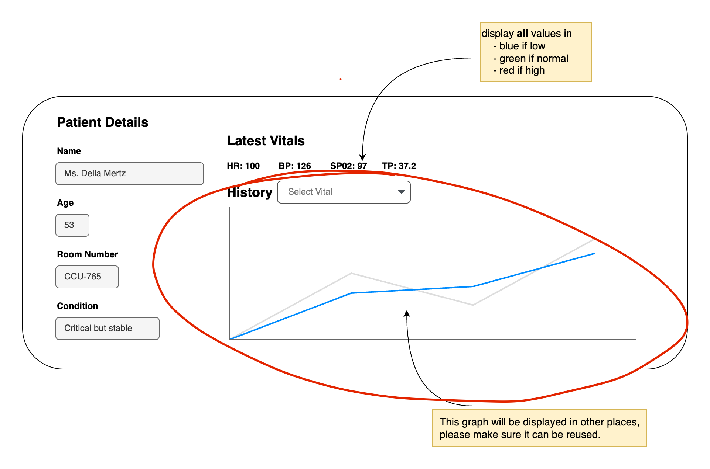

# Technical Test for Senior Frontend Developer
### Total Time: Approximately 120 minutes
- Briefing & Setup (5 mins)
- Focused Coding Challenge (90 mins)
- Code Review & Conceptual Q&A (20-25 min)

### Core Skills Assessed
- Frontend Development (Angular/TypeScript)
- Data Visualization & UI (simplified)
- API Integration & Reliability (basics)

### Technologies
- Frontend: Angular (latest stable or 17+), TypeScript, RxJS
- CDS Components: Simplified guideline (focus on consistency)
- Backend API: Provided

## Part 1: Briefing & Setup (5 minutes)
- Quick overview of the test structure.
- Clarify the objective of the coding challenge.
- Explain that backend API endpoints is provided 
- Answer any immediate setup questions.

## Part 2: Focused Coding Challenge (90 minutes)
### Objective
1. Update the patient details modal view to include a "Vital Signs Display".In order to do that create a reusable component PatientVitalDisplayComponent. You will fetch data from provided API endpoints, display patient information, their latest vitals, and a historical trend for one vital sign.

2. Ensure your UI component (data display sections, labels, values) has a clean and consistent look. Focus on clarity and readability of the medical data.


### Available Endpoints
**Get Patient Profile**
```
Endpoint: GET http://localhost:3007/api/patients/pat123/profile
Expected Response (JSON):
JSON

{
  "id": "pat123",
  "name": "Eleanor Vance",
  "age": 67,
  "roomNumber": "ICU-305",
  "condition": "Stable post-op"
}
```

**Get Latest Vital Signs**
```
Endpoint: GET http://localhost:3007/api/patients/pat123/vitals/latest
Expected Response (JSON):
JSON

{
  "heartRate": { "value": 72, "unit": "bpm", "status": "normal" },
  "bloodPressure": { "systolic": 125, "diastolic": 82, "unit": "mmHg", "status": "normal" },
  "spO2": { "value": 97, "unit": "%", "status": "normal" },
  "temperature": { "value": 37.1, "unit": "°C", "status": "normal" }
}
```

**Get Historical Heart Rate**
```
Endpoint: GET http://localhost:3007/api/patients/pat123/vitals/HeartRate/history
Expected Response (JSON):
JSON

[
  { "timestamp": "2024-05-28T10:00:00Z", "value": 70 },
  { "timestamp": "2024-05-28T10:05:00Z", "value": 72 },
  { "timestamp": "2024-05-28T10:10:00Z", "value": 71 },
  // ... (approx. 10-15 data points)
  { "timestamp": "2024-05-28T11:00:00Z", "value": 75 }
]
```

### Guidelines

**Angular Application Setup**  
- Extend the current application following the provided folder architecture
- Create a PatientVitalDisplayComponent.

**Data Service**  
- Use proper angular service to handle fetching data from the three API endpoints.

### PatientVitalDisplayComponent Implementation
**UI Proposal**

The above diagram shows the expected layout for the patient details modal with vital signs display.

- Display Patient Profile: Clearly present the patient's name, age, roomNumber, and condition.
- Display Latest Vitals: Show the latest heartRate, bloodPressure, spO2, and temperature in a structured and readable format. Include units and consider visually indicating the status.

- Display Historical Heart Rate: Primary Goal (if time is tight): Display the historical heart rate data as a formatted list (e.g., "Time: [formatted timestamp], HR: [value] bpm").

- Loading & Error States: Implement a simple loading indicator (e.g., "Loading patient data...") while API calls are in progress.

- Display user-friendly error messages if any API call fails (e.g., "Failed to load patient profile.").

**TypeScript**
- Define clear TypeScript interfaces for the data structures (Profile, LatestVital, VitalValue, HistoricalDataPoint).
- Use strong typing throughout your component and service.

**Styling (CDS Guideline)**
- Apply simple, clean BEM style, SCSS to ensure data is presented clearly and professionally. Focus on readability and visual organization.

### Deliverable
- Be prepared to share your screen and walk through your code.

